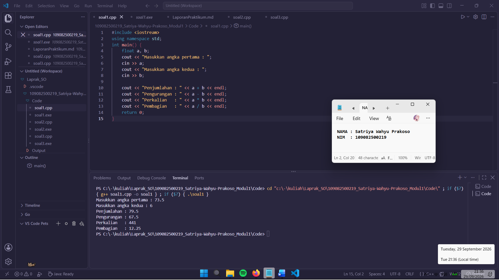
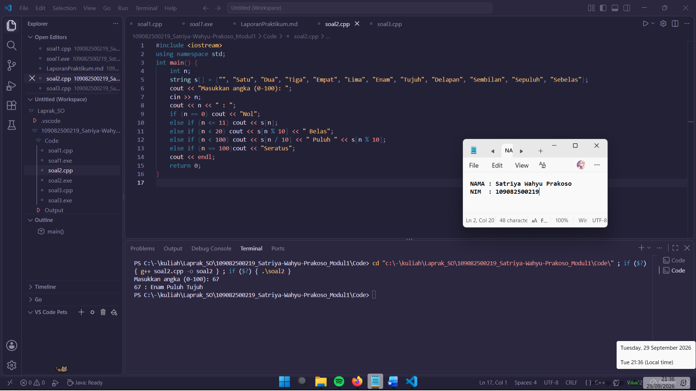
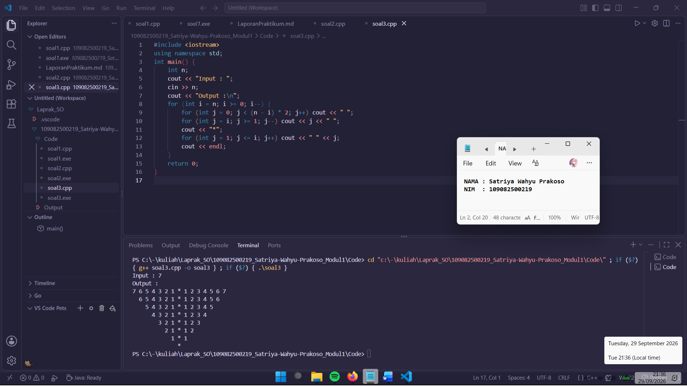

# **Laporan Praktikum Modul 1 \- Codeblocks IDE & Pengenalan Bahas C++ (Bagian Pertama)**

# 

Satriya Wahyu Prakoso \- 109082500219

## Dasar Teori

Struktur Data adalah metode penyimpanan, penyusunan, dan pengaturan data di dalam memori komputer atau file secara efektif agar dapat digunakan secara efisien. Pemilihan struktur data yang tepat akan menghasilkan algoritma yang lebih jelas, tepat, dan membuat program secara keseluruhan menjadi lebih sederhana.

## A. Konsep Variabel dan Tipe Data

1. Variabel digunakan dalam program untuk menyatakan nilai yang dapat berubah-ubah selama eksekusi berlangsung, sedangkan konstanta digunakan untuk menyatakan nilai tetap.
2. Tipe data sederhana tunggal digunakan untuk menyimpan satu nilai pada satu variabel, contohnya adalah int (bilangan bulat), float / double (bilangan pecahan), dan char (karakter alfabetik atau simbol).
3. Operasi dasar matematika dalam C++ mencakup penjumlahan (+), pengurangan (-), perkalian (*), pembagian (/), dan sisa hasil bagi atau modulus (%).

## B. Struktur Data Terstruktur dan Majemuk

1. Array : Struktur data sederhana berbentuk himpunan elemen terurut dan homogen yang dialokasikan pada memori komputer secara statis. Array dapat berupa dimensi satu (vektor), dimensi dua (matriks), maupun dimensi banyak.
2. Struct : Fitur dalam C++ yang bermanfaat untuk mengelompokkan sejumlah data/variabel bermacam tipe yang berlainan ke dalam satu nama objek.
3. Linked List: Struktur data dinamis berupa kumpulan komponen yang disebut simpul (node) yang saling terhubung secara berurutan dengan bantuan pointer.
4. Stack : Struktur data linier yang menerapkan prinsip LIFO (Last-In-First-Out), di mana penambahan dan pengambilan data hanya bisa dilakukan pada satu ujung atas (Top).
5. Queue : Struktur data linier yang menerapkan prinsip FIFO (First-In-First-Out), di mana penyisipan dilakukan di ujung belakang dan penghapusan di ujung depan.

## Guided

### 1. Operator Aritmatika dan Casting

```cpp
#include <iostream>
using namespace std;
int main() {
	int W, X, Y; float Z;
    X = 7; Y = 3; W = 1;
    Z = (X + Y)/(Y + W);
    cout<< "Nilai z = " << Z << endl;
    return 0;
}
```

Program menjumlahkan pembilang dan penyebut, lalu membaginya. Karena pembagian dilakukan antar bilangan bulat, komputer otomatis membuang angka desimal di belakang koma sehingga hasil akhir yang dicetak ke layar adalah Nilai z = 2, bukan 2.5 .

### 2. Percabangan `if-else`

```cpp
#include <iostream>
using namespace std;
int main(){
    double tot_pembelian, diskon;
    cout<<"total pembelian: Rp";
    cin>>tot_pembelian;
    diskon = 0;
    if(tot_pembelian >= 100000)
    diskon = 0.05*tot_pembelian;
    cout<<"besar diskon = Rp" <<diskon;
}
```

Program menghitung diskon belanja sebesar 5% jika total pembelian mencapai Rp100.000 atau lebih. Jika total pembeliannya di bawah itu, nilai diskon tetap Rp0 karena kondisi if tidak terpenuhi, lalu program akan menampilkan jumlah potongan harganya.

### 3. Perulangan dan Struktur Data

```cpp
#include <iostream>
#include <string>
using namespace std;
struct Siswa {
	string nama;
	int nilai;
};

int main() {
	Siswa siswa[2];
	for (int i = 0; i < 2; i++) {
		cout << "Nama siswa ke-" << i + 1 << ": ";
		cin >> siswa[i].nama;
		cout << "Nilai siswa ke-" << i + 1 << ": ";
		cin >> siswa[i].nilai;
	}

	cout << "\nData siswa\n";
	for (int i = 0; i < 2; i++) {
		cout << siswa[i].nama << " - " << siswa[i].nilai << endl;
	}
	return 0;
}
```

Program menggunakan array berisi struct Siswa untuk menyimpan data nama dan nilai. Perulangan for digunakan secara bergantian untuk menerima input data dan menampilkan daftar dua siswa tersebut.

## Unguided

### 1\. Buatlah program yang menerima input-an dua buah bilangan betipe float, kemudian memberikan output-an hasil penjumlahan, pengurangan, perkalian, dan pembagian dari dua bilangan tersebut

```cpp
#include <iostream>
using namespace std;
int main() {
    float a, b;
    cout << "Masukkan angka pertama : ";
    cin >> a;
    cout << "Masukkan angka kedua : ";
    cin >> b;
    
    cout << "Penjumlahan : " << a + b << endl;
    cout << "Pengurangan : " << a - b << endl;
    cout << "Perkalian   : " << a * b << endl;
    cout << "Pembagian   : " << a / b << endl;
    return 0;
}
```

### Output Unguided 1 :

##### Output 1



Program menerima input dua buah bilangan. Hasil dari operasi penjumlahan, pengurangan, perkalian, dan pembagian kedua bilangan tersebut kemudian langsung dihitung dan ditampilkan.

### 2\. Buatlah sebuah program yang menerima masukan angka dan mengeluarkan output nilai angka tersebut dalam bentuk tulisan. Angka yang akan di-input-kan user adalah bilangan bulat positif mulai dari 0 s.d 100

```cpp
#include <iostream>
using namespace std;
int main() {
    int n;
    string s[] = {"", "Satu", "Dua", "Tiga", "Empat", "Lima", "Enam", "Tujuh", "Delapan", "Sembilan", "Sepuluh", "Sebelas"};
    cout << "Masukkan angka (0-100): ";
    cin >> n;
    cout << n << " : ";
    if (n == 0) cout << "Nol";
    else if (n <= 11) cout << s[n];
    else if (n < 20) cout << s[n % 10] << " Belas";
    else if (n < 100) cout << s[n / 10] << " Puluh " << s[n % 10];
    else if (n == 100)cout << "Seratus";
    cout << endl;
    return 0;
}
```

### Output Unguided 2 :

##### Output 1



Program menggunakan array kata dan if-else untuk mengubah input angka (0-100) menjadi teks.

### 3\. Buatlah program yang dapat memberikan input dan output sbb.

```cpp
#include <iostream>
using namespace std;
int main() {
    int n;
    cout << "Input : ";
    cin >> n;
    cout << "Output :\n";
    for (int i = n; i >= 0; i--) {
        for (int j = 0; j < (n - i) * 2; j++) cout << " ";
        for (int j = i; j >= 1; j--) cout << j << " ";
        cout << "*";
        for (int j = 1; j <= i; j++) cout << " " << j;
        cout << endl;
    }
    return 0;
}
```

### Output Unguided 3 :

##### Output 1



Program menggunakan perulangan untuk mencetak pola angka dan bintang berbentuk segitiga terbalik. Nilai variabel i mengatur baris secara menurun, sementara perulangan di dalamnya mencetak spasi, urutan angka kiri-kanan, dan tanda bintang di posisi tengah.

## Kesimpulan

Materi tipe data, variabel, input-output, operator aritmatika, percabangan, perulangan, fungsi, array, dan struktur di praktikum ini meningkatkan pemahaman saya tentang C++. Saya lebih paham tentang cara kerja program C++ dalam menghitung angka, mengubah angka menjadi tulisan, menyusun spasi dn bintang untuk membuat gambar segitiga terbalik.

## Referensi

\[1\] Triase. (2020). Diktat Edisi Revisi : STRUKTUR DATA. Medan: UNIVERSTAS ISLAM NEGERI SUMATERA UTARA MEDAN.   
\[2\] Naibaho, L. P., Pangaribuan, M., Sinaga, K. B., Lestari, K. P., & Gunawan, I. (2012). "JURNAL STRUKTUR DATA: DATA & STRUKTUR DATA". Jurnal Teknik Informatika STIKOM Tunas Bangsa Pematangsiantar. Diunggah oleh Ghiyas Ahyar. 