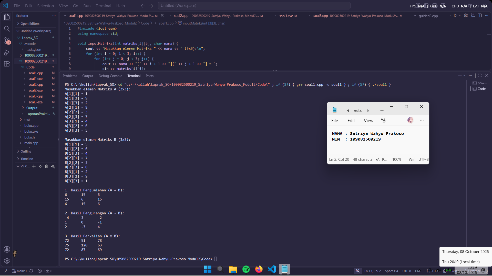
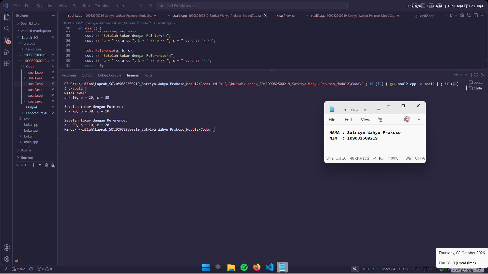
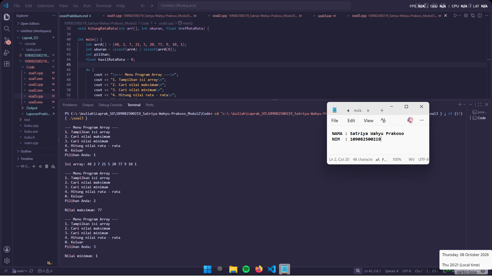
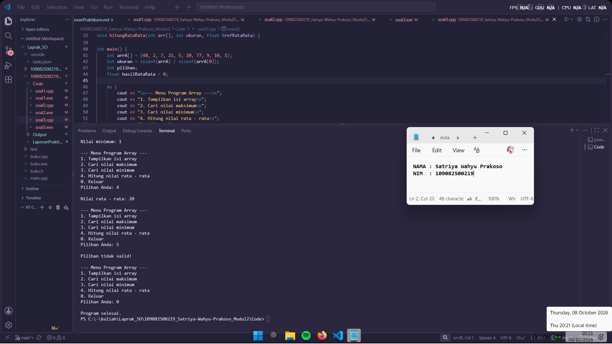

# **Laporan Praktikum Modul 2\- Codeblocks IDE & Pengenalan Bahas C++ (Bagian Kedua)**

# 

Satriya Wahyu Prakoso \- 109082500219

## Dasar Teori

Struktur Data adalah metode penyimpanan, penyusunan, dan pengaturan data di dalam memori komputer atau file secara efektif agar dapat digunakan secara efisien. Pemilihan struktur data yang tepat akan menghasilkan algoritma yang lebih jelas, tepat, dan membuat program secara keseluruhan menjadi lebih sederhana.

## A. Konsep Dasar Array (Larik)

1. Array merupakan kumpulan data dengan nama yang sama di mana setiap komponen atau elemennya memiliki tipe data yang sejenis (homogen).
2. Pengaksesan setiap komponen di dalam array dilakukan berdasarkan urutan indeksnya. Di dalam C++, indeks array selalu dimulai dari angka 0 untuk elemen pertama, angka 1 untuk elemen kedua, dan seterusnya.
3. Array dapat dideklarasikan dalam bentuk satu dimensi (vektor), dua dimensi (matriks), maupun berdimensi banyak tergantung kebutuhan kompleksitas data yang diolah.

## B. Variabel Pointer dan Alamat Memori

1. Memori komputer (RAM) dapat digambarkan sebagai sebuah array satu dimensi berukuran sangat besar yang setiap selnya memiliki alamat ("address") atau identitas unik tersendiri.
2. Variabel pointer adalah jenis variabel khusus yang digunakan untuk menyimpan alamat memori dari variabel lain, bukan menyimpan nilai data biasa.
3. Untuk memanipulasi alamat dan nilai melalui pointer, digunakan dua jenis operator utama:
   * Operator Alamat atau Address-of (`&`): Digunakan di depan nama variabel untuk mengetahui lokasi alamat memorinya.
   * Operator Dereference (`*`): Digunakan untuk mendeklarasikan variabel pointer serta mengambil nilai asli yang berada di dalam alamat memori yang ditunjuk.

## C. Perbedaan Array String dan Pointer String

1. String pada dasarnya merupakan kumpulan karakter atau array bertipe `char` yang diakhiri oleh karakter null (`'\0'`) sebagai penanda akhir teks.
2. Array string (`char nama[]`) bersifat statis di mana ukuran memorinya hanya cukup untuk menampung teks inisialisasi awal, tetapi tiap-tiap karakter di dalamnya masih dapat dimodifikasi secara bebas.
3. Pointer string (`char *nama`) berfungsi menunjuk langsung ke suatu lokasi konstanta string di memori. Pointer ini bisa diubah untuk menunjuk ke alamat teks lain, tetapi isi dari teks konstanta yang ditunjuknya tidak dapat dimodifikasi.

## D. Struktur Fungsi dan Prosedur

1. Fungsi dan prosedur merupakan blok kode program terpisah yang dirancang khusus untuk menangani tugas tertentu agar program menjadi lebih modular, mudah dipahami, dan terhindar dari duplikasi kode.
2. Fungsi (*Function*) adalah jenis blok kode yang wajib mengembalikan suatu nilai balik (`return value`) kepada kode yang memanggilnya, serta dideklarasikan dengan tipe data keluaran tertentu (seperti `int`, `float`, atau `char`).
3. Prosedur (*Procedure*) adalah jenis fungsi yang tidak memberikan atau mengembalikan nilai balik kepada pemanggilnya, dan diidentifikasi secara khusus menggunakan keyword `void` dalam C++.

## E. Metode Pengiriman Parameter Fungsi

1. Parameter formal adalah variabel penampung yang dituliskan pada daftar parameter saat fungsi didefinisikan, sedangkan parameter aktual adalah nilai atau variabel nyata yang digunakan saat fungsi tersebut dipanggil.
2. *Call by Value*: Metode pengiriman di mana nilai dari parameter aktual disalin ke dalam parameter formal. Perubahan nilai di dalam fungsi tidak akan memengaruhi nilai variabel asli di luar fungsi.
3. *Call by Pointer*: Metode pengiriman yang melewatkan alamat memori suatu variabel menggunakan operator pointer (`*`), sehingga fungsi dapat langsung mengubah nilai variabel asli di luar fungsi.
4. *Call by Reference*: Metode pengiriman yang melewatkan variabel asli menggunakan parameter alias (`&`). Metode ini memiliki efek yang sama dengan *call by pointer* untuk mengubah data asli, namun dengan sintaks pemanggilan yang lebih sederhana tanpa operator tambahan.

## Guided

### 1. Program Array 1D dan 2D

```cpp
#include <iostream>
#define MAX 5
using namespace std;

int main() {
	int i, j;
	float nilai[MAX];
	static int nilai_tahun[MAX][MAX] = {
		{0, 2, 2, 0, 0},
		{0, 1, 1, 1, 0},
		{0, 3, 3, 3, 0},
		{4, 4, 0, 0, 4},
		{5, 0, 0, 0, 5}
	};

	for (i = 0; i < MAX; i++) {
		cout << "masukkan nilai ke-" << i + 1 << endl;
		cin >> nilai[i];
	}
	cout << "\ndata nilai siswa :\n";
	for (i = 0; i < MAX; i++) {
		cout << "nilai ke-" << i + 1 << " = " << nilai[i] << endl;
	}
	cout << "\nnilai tahunan :\n";
	for (i = 0; i < MAX; i++) {
		for (j = 0; j < MAX; j++) cout << nilai_tahun[i][j];
		cout << "\n";
	}
	return 0;
}
```

Program meminta pengguna memasukkan 5 nilai data ke dalam array satu dimensi. Lalu, program akan menampilkan daftar nilai siswa tersebut serta mencetak isi array dua dimensi nilai_tahun dalam bentuk tabel menggunakan perulangan di dalam perulangan.

### 2. Program Alamat Memori dan Pointer

```cpp
#include <iostream>
using namespace std;

int main(){
    int x, y;
    int *px;

    x = 87;
    px = &x;
    y = *px;

    cout << "Alamat x = " << &x << endl;
    cout << "Isi px = " << px << endl;
    cout << "Isi x = " << x << endl;
    cout << "Nilai yang ditunjuk px= " << *px << endl;
    cout << "Nilai y= " << y << endl;

    return 0;
}
```

Program meminta pengguna memasukkan 3 buah bilangan bulat secara berurutan. Nilai tersebut kemudian diproses oleh fungsi maks3() untuk dicari angka mana yang paling besar, lalu hasilnya langsung ditampilkan.

### 3. Fungsi Nilai Maksimum

```cpp
#include <iostream>
using namespace std;

int maks3(int a, int b, int c);

int main() {
	int x, y, z;
	cout << "masukkan nilai bilangan ke-1 = ";
	cin >> x;
	cout << "masukkan nilai bilangan ke-2 = ";
	cin >> y;
	cout << "masukkan nilai bilangan ke-3 = ";
	cin >> z;
	cout << "nilai maksimumnya adalah = " << maks3(x, y, z);
	return 0;
}

int maks3(int a, int b, int c) {
	int maksimum = a;
	if (b > maksimum) maksimum = b;
	if (c > maksimum) maksimum = c;
	return maksimum;
}
```

Fungsi maks3() bekerja dengan menerima 3 parameter angka. Nilai pertama disimpan sebagai nilai awal pada variabel maksimum, lalu dibandingkan dengan nilai kedua dan ketiga menggunakan perintah if untuk menentukan angka terbesar yang akan dikembalikan.

### 4. Prosedur Cetak Baris

```cpp
#include <iostream>
using namespace std;

void tulis(int jumlah);

int main() {
	int jumlah;
	cout << "jumlah baris kata = ";
	cin >> jumlah;
	tulis(jumlah);
	return 0;
}

void tulis(int jumlah) {
	for (int i = 0; i < jumlah; i++) {
		cout << "baris ke-" << i + 1 << endl;
	}
}
```

Prosedur ini menerima input jumlah baris dari pengguna, lalu melakukan perulangan for untuk menampilkan teks penanda baris secara berurutan.

### 5. Fungsi Pertukaran Nilai Variabel

```cpp
#include <iostream>
using namespace std;

void tukarValue(int &x, int &y) {
	int temp = x;
	x = y;
	y = temp;
}

void tukarPointer(int *x, int *y) {
	int temp = *x;
	*x = *y;
	*y = temp;
}

void tukarReference(int &x, int &y) {
	int temp = x;
	x = y;
	y = temp;
}

int main() {
	int a = 5, b = 10;
	cout << "Sebelum tukarValue: a = " << a << ", b = " << b << endl;
	tukarValue(a, b);
	cout << "Setelah tukarValue: a = " << a << ", b = " << b << endl;
	cout << "Sebelum tukarPointer: a = " << a << ", b = " << b << endl;
	tukarPointer(&a, &b);
	cout << "Setelah tukarPointer: a = " << a << ", b = " << b << endl;
	cout << "Sebelum tukarReference: a = " << a << ", b = " << b << endl;
	tukarReference(a, b);
	cout << "Setelah tukarReference: a = " << a << ", b = " << b << endl;
	return 0;
}
```

Program membandingkan cara penukaran nilai variabel di dalam fungsi. Fungsi tukarPointer() menggunakan alamat memori dan operator *, sedangkan fungsi lainnya menggunakan parameter referensi & agar perubahan nilai variabelnya bisa langsung diterapkan pada variabel asli di fungsi main.

## Unguided

### 1\. Buatlah program yang dapat melakukan operasi penjumlahan, pengurangan, dan perkalian matriks 3x3.

```cpp
#include <iostream>
using namespace std;

void inputMatriks(int matriks[3][3], char nama) {
    cout << "Masukkan elemen Matriks " << nama << " (3x3):\n";
    for (int i = 0; i < 3; i++) {
        for (int j = 0; j < 3; j++) {
            cout << nama << "[" << i + 1 << "][" << j + 1 << "] = ";
            cin >> matriks[i][j];
        }
    }
    cout << endl;
}

void tampilkanMatriks(int matriks[3][3]) {
    for (int i = 0; i < 3; i++) {
        for (int j = 0; j < 3; j++) cout << matriks[i][j] << "\t";
        cout << endl;
    }
    cout << endl;
}

void tambahMatriks(int A[3][3], int B[3][3], int hasil[3][3]) {
    for (int i = 0; i < 3; i++)
        for (int j = 0; j < 3; j++) hasil[i][j] = A[i][j] + B[i][j];
}

void kurangMatriks(int A[3][3], int B[3][3], int hasil[3][3]) {
    for (int i = 0; i < 3; i++)
        for (int j = 0; j < 3; j++) hasil[i][j] = A[i][j] - B[i][j];
}

void kaliMatriks(int A[3][3], int B[3][3], int hasil[3][3]) {
    for (int i = 0; i < 3; i++) {
        for (int j = 0; j < 3; j++) {
            hasil[i][j] = 0;
            for (int k = 0; k < 3; k++) hasil[i][j] += A[i][k] * B[k][j];
        }
    }
}

int main() {
    int matriksA[3][3], matriksB[3][3], hasilTambah[3][3], hasilKurang[3][3], hasilKali[3][3];

    inputMatriks(matriksA, 'A');
    inputMatriks(matriksB, 'B');

    tambahMatriks(matriksA, matriksB, hasilTambah);
    kurangMatriks(matriksA, matriksB, hasilKurang);
    kaliMatriks(matriksA, matriksB, hasilKali);

    cout << "1. Hasil Penjumlahan (A + B):\n"; tampilkanMatriks(hasilTambah);
    cout << "2. Hasil Pengurangan (A - B):\n"; tampilkanMatriks(hasilKurang);
    cout << "3. Hasil Perkalian (A x B):\n";   tampilkanMatriks(hasilKali);
    return 0;
}
```

### Output Unguided 1 :

##### Output 



Program ini menghitung penjumlahan, pengurangan, dan perkalian dua buah matriks 3x3. Program meminta memasukkan angka untuk Matriks A dan B satu per satu sesuai dengan baris dan kolomnya. Kalau semua angka sudah diisi, program akan langsung memproses perhitungan lewat fungsi prosedur yang sudah dipisah, lalu menampilkan ketiga hasilnya sekaligus.

### 2\. Berdasarkan guided pointer dan reference sebelumnya, buatlah keduanya dapat menukar nilai dari 3 variabel.

```cpp
#include <iostream>
using namespace std;

void tukarPointer(int *x, int *y, int *z) {
    int temp = *x;
    *x = *y;
    *y = *z;
    *z = temp;
}

void tukarReference(int &x, int &y, int &z) {
    int temp = x;
    x = y;
    y = z;
    z = temp;
}

int main() {
    int a = 10, b = 20, c = 30;

    cout << "Nilai awal:\n";
    cout << "a = " << a << ", b = " << b << ", c = " << c << "\n\n";

    tukarPointer(&a, &b, &c);
    cout << "Setelah tukar dengan Pointer:\n";
    cout << "a = " << a << ", b = " << b << ", c = " << c << "\n\n";

    tukarReference(a, b, c);
    cout << "Setelah tukar dengan Reference:\n";
    cout << "a = " << a << ", b = " << b << ", c = " << c << "\n";
    return 0;
}
```

### Output Unguided 2 :

##### Output 



Program ini menukar nilai dari 3 buah variabel secara berputar menggunakan bantuan variabel penampung sementara. Proses penukaran ini diuji dengan dua cara yang berbeda, menggunakan fungsi tukarPointer() yang bekerja lewat alamat memori variabel, dan fungsi tukarReference() yang langsung mengubah nilai variabel asli menggunakan aliasnya.

### 3\. Diketahui sebuah array 1 dimensi sebagai berikut : arrA = {48, 2, 7 , 21, 5, 20, 77, 9, 10, 1}. Buatlah program yang dapat mencari nilai minimum, maksimum, dan rata – rata dari array tersebut!

```cpp
#include <iostream>
using namespace std;

void tampilkanArray(int arr[], int ukuran) {
    cout << "Isi array: ";
    for (int i = 0; i < ukuran; i++) {
        cout << arr[i] << " ";
    }
    cout << endl;
}

int cariMaksimum(int arr[], int ukuran) {
    int maks = arr[0];
    for (int i = 1; i < ukuran; i++) {
        if (arr[i] > maks) {
            maks = arr[i];
        }
    }
    return maks;
}

int cariMinimum(int arr[], int ukuran) {
    int min = arr[0];
    for (int i = 1; i < ukuran; i++) {
        if (arr[i] < min) {
            min = arr[i];
        }
    }
    return min;
}

void hitungRataRata(int arr[], int ukuran, float &refRataRata) {
    float total = 0;
    for (int i = 0; i < ukuran; i++) {
        total += arr[i];
    }
    refRataRata = total / ukuran;
}

int main() {
    int arrA[] = {48, 2, 7, 21, 5, 20, 77, 9, 10, 1};
    int ukuran = sizeof(arrA) / sizeof(arrA[0]);
    int pilihan;
    float hasilRataRata = 0;

    do {
        cout << "\n--- Menu Program Array ---\n";
        cout << "1. Tampilkan isi array\n";
        cout << "2. Cari nilai maksimum\n";
        cout << "3. Cari nilai minimum\n";
        cout << "4. Hitung nilai rata - rata\n";
        cout << "0. Keluar\n";
        cout << "Pilihan Anda: ";
        cin >> pilihan;
        cout << endl;

        switch (pilihan) {
            case 1:
                tampilkanArray(arrA, ukuran);
                break;
            case 2:
                cout << "Nilai maksimum: " << cariMaksimum(arrA, ukuran) << endl;
                break;
            case 3:
                cout << "Nilai minimum: " << cariMinimum(arrA, ukuran) << endl;
                break;
            case 4:
                hitungRataRata(arrA, ukuran, hasilRataRata);
                cout << "Nilai rata - rata: " << hasilRataRata << endl;
                break;
            case 0:
                cout << "Program selesai.\n";
                break;
            default:
                cout << "Pilihan tidak valid!\n";
        }
    } while (pilihan != 0);

    return 0;
}
```

### Output Unguided 3 :

##### Output 





Aplikasi simple untuk mengolah data angka di dalam array menggunakan sistem menu interaktif. Pengguna bisa memilih menu untuk melihat isi array, mencari angka paling besar, mencari angka paling kecil, atau menghitung nilai rata-rata. Proses hitung rata-ratanya sendiri menggunakan parameter reference agar hasilnya bisa langsung muncul di fungsi utama.

## Kesimpulan

Praktikum ini membuat saya menjadi lebih paham tentang array, pointer, alamat memori, fungsi, prosedur, dan parameter. Array satu dan dua dimensi berguna untuk mengelompokkan angka, contohnya saat menyusun baris dan kolom untuk menghitung operasi matriks. Lalu pointer dan reference bisa langsung mengubah nilai variabel asli dari dalam fungsi lewat alamat memorinya tanpa harus menduplikasi data. Memisah-misahkan kode program menjadi fungsi dan prosedur membuat struktur logika menjadi lebih rapi, terstruktur, dan tidak menumpuk di satu tempat.

## Referensi

\[1\] Triase. (2020). Diktat Edisi Revisi: Struktur Data. Medan: Universitas Islam Negeri Sumatera Utara Medan.
\[2\] Ma'arif, A. (2022). *Buku Ajar Dasar Pemrograman C++*. Yogyakarta: UAD Press. Tersedia di: [Eprints UAD](https://uad.ac.id).
\
